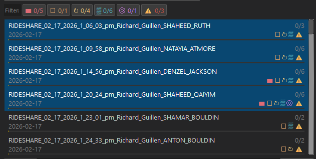

# How to Search

Imagine you’re looking at a signature where the handwriting is **not perfectly clear**.

This is the case for almost every signature for at least one field, like their name, address, or city.

<figure><figcaption></figcaption></figure>

Notice how many fields are partially or fully illegible. The first name is legible (**"Derek"**), but:

* The last name is messy; you can only confidently see that it starts with **“Fl”**
* The street number is also messy; you can confidently see it ends in **“77”**
* The street name is messy too; it clearly starts with **“Ma”** but the rest is up for debate
* The city is messy, but definitively contains an **"ra"** in the middle of it

Even with these minimal clues, you can still make a powerful search query that will likely return the correct voter, as long as they are in the database and you did not include any incorrect characters in your query.

Here's what your search will look like in this instance:

```
'derek' 'fl ''77 'ma ra
```

At first glance, this search may look unusual — but this is how you will be searching from now on. The logic behind the apostrophes will be explained soon.

Remember, you are **not trying to type exactly what the signer wrote**. Their writing is often too unreliable.

Instead, you are typing **only what you see** — **small, reliable pieces of information,** or "clues," that Certifi can match to a voter.

<figure><figcaption></figcaption></figure>

Even though this query looks short and incomplete, it is **more effective** than typing everything out.

This seemingly vague search only yields **one** result, which is the correct voter.

This example showcases how powerful this search method can be.

<figure><figcaption></figcaption></figure>

***

### Search Order

Certifi reads your search **left to right** in this exact order:

1. First Name
2. Last Name
3. Street Number
4. Street Name
5. City

Each space separates one field.

**Always use this order. Do not deviate from it.**

Here's Derek's information:

<pre><code><strong>DEREK FLORES
</strong>3477 MARICOPA ST, APT 32
TORRANCE, CA
</code></pre>

Notice how the search from above was in this order:

```
first last # street city
```

```
'derek' 'fl ''77 'ma ra
```

***

### Minimum Characters Per Field

When you enter a value for a field, you must type **at least two characters** for Certifi to search it.

One character is **not enough,** except for the street number.

<figure><figcaption></figcaption></figure>

**Rule of thumb:** If you only know one character, **skip the field.**

***

### Skipping a Field

If you want to **skip a field entirely**, type a single period:

```
.
```

This tells Certifi: **“Ignore this field and move to the next one.”**

#### Example

```
. 'fl ''77 'ma ra
```

* First name is skipped
* Last name starts with **"fl"**
* Street number ends with **"77"**
* Street name starts with **"ma"**
* City name contains **"ra"**

***

### Using Apostrophes (`'`)

Apostrophes are your new best friends. You will be using the single apostrophes, not the double apostrophes. You don't need to hold shift to select one. They tell Certifi **how strict the match should be.**

You can search **loosely** or **very precisely**, depending on what you can read.

#### Apostrophe Rules

| What You Type | What Certifi Looks For            |
| ------------- | --------------------------------- |
| `word`        | Appears **anywhere** in the field |
| `'word`       | Field **starts with**             |
| `''word`      | Field **ends with**               |
| `'word'`      | **Exact match only**              |
| `.`           | **Skip** a field                  |


When searching in Certifi, **less is almost always better**.


If **even one character is wrong,** it can completely prevent the correct voter from appearing. The more characters you type, the more likely you are to misinterpret one and prevent the correct match from appearing at all. This is especially important with **street numbers,** where a single incorrect digit will eliminate the match entirely.

For this reason, you should **always start with the loosest search possible**, using only the characters you are most confident about. Even if the search feels vague, it is often **more effective** than attempting to be precise. If you try to add extra letters or numbers and get no results, remove them and search looser again.

Once results appear, **then** tighten the search gradually to narrow them down — never the other way around.


**Rule to remember:** A loose search that returns results is **always better** than a precise search that returns nothing.


This mindset is critical. Many missed matches happen not because the voter isn’t in the database, but because **too much information was typed too early**.

***

### Example Search

```
'derek' 'fl ''77 'ma ra
```

#### What This Means

| Field         | Input     | Interpretation     |
| ------------- | --------- | ------------------ |
| First Name    | `'derek'` | Exactly **DEREK**  |
| Last Name     | `'fl`     | Starts with **FL** |
| Street Number | `''77`    | Ends with **77**   |
| Street Name   | `'ma`     | Starts with **MA** |
| City          | `ra`      | Contains **RA**    |

#### Example Result

All that was needed to find Derek was the above query, which you can see by the bolded characters below:

<figure><figcaption></figcaption></figure>

***

### Common Search Mistakes (and How to Avoid Them)

These mistakes slow you down and hide good matches. Read this once — it will save you time every shift.

#### ❌ Using Apostrophes When You Don’t Need Them

**Mistake:**\
Starting with very strict searches like exact matches.

**Fix:**\
Start loose, then tighten your search to narrow down results only if needed.

```
. fl 77 ma torr
```

If too many results appear, _then_ tighten:

```
. 'fl ''77 'ma 'torrance'
```

Loose first. Tighten later.

***

#### ❌ Forgetting Apostrophes Mean Different Things

**Mistake:**\
Assuming any apostrophe does the same thing.

**Remember:**

* `'word` = starts with
* `''word` = ends with
* `'word'` = exact
* `word` = contains

One character changes the entire search.

***

#### ❌ Trying to Type the Full Name or Address

**Mistake:**\
Typing everything exactly as written.

**Fix:**\
Type only what you can clearly read.

```
'dere fl 77 ma .
```

You are typing **clues**, not full information.

***

#### ❌ Guessing Letters in a Field

**Mistake:**\
Guessing a street number or name instead of skipping it. Typing the **wrong** character will **not** yield the correct voter.

**Fix:**\
If you are unsure, skip it.

```
. fl . ma .
```

Guessing what someone has written reduces accuracy and creates bad matches.

***

### Effective Search Examples

<figure><figcaption></figcaption></figure>

```
mois cerr 32 132 hawthorne
```

<figure><figcaption></figcaption></figure>

***

<figure><figcaption></figcaption></figure>

```
fran ram 4616 . lawndale
```

<figure><figcaption></figcaption></figure>

***

<figure><figcaption></figcaption></figure>

```
alexa 'de 14501 halldale .
```

<figure><figcaption></figcaption></figure>


Expanding the voter will show you the zip code.


***

<figure><figcaption></figcaption></figure>

```
jam ebrahim 208 irena 'redondo beach'
```

<figure><figcaption></figcaption></figure>


Always ignore a street name's directional prefix in your query ("east" or "e," "south" or "s," etc.).&#x20;



To make an exact query for a street name or city that is comprised of two or more words, use single quotes around the words. \
\
Ex: Redondo Beach is searched as 'redondo beach', although searching just _redondo_ works too.


***

<figure><figcaption></figcaption></figure>

```
linda rkie 125 beryl redondo
```

<figure><figcaption></figcaption></figure>

***

<figure><figcaption></figcaption></figure>

```
''an 'br 1106 . harbor
```

<figure><figcaption></figcaption></figure>

***

<figure><figcaption></figcaption></figure>

```
josh . 3301 83rd inglewood
```

<figure><figcaption></figcaption></figure>


Again, ignore the directional of a street name. The signer wrote "West 83rd". Don't be fooled and search _west_ in the street name field — it will yield no results.


```
josh . 3301 west inglewood
```

The above query yields no results.

***

<figure><figcaption></figcaption></figure>

<pre><code><strong>carmen 'nic 1287 . .
</strong></code></pre>

<figure><figcaption></figcaption></figure>


Be careful not to interpret a signer's middle name as their last name. This will cause you to miss the correct match. _Nichols_ is barely visible in their printed name.


***

<figure><figcaption></figcaption></figure>

```
'anq ''ing '15 ''3th carson
```

<figure><figcaption></figcaption></figure>


Be cautious when a signer blends two fields too close together. They seemingly wrote "155213th" for their address. Notice my search parameters for the street number and street name — they're hyper specific.&#x20;


***

<figure><figcaption></figcaption></figure>

```
. thompson 15517 eucalyptus bellflower
```

<figure><figcaption></figcaption></figure>


The signer either misspelled their first name, or it's incorrectly filed in the database. Searching for _\`trid_ yields no results, even though that's what is written. Regardless, always edit your queries to try again after no results appear for a signer.


***

<figure><figcaption></figcaption></figure>

```
. miles 1805 23rd .
```

<figure><figcaption></figcaption></figure>


If a city is abbreviated or initialized and you don't know its full name so you can query it, you can confidently skip it with a "." as long as there are enough other details in your query. If not, look up the zip code to find out the city, then type it in.


***

<figure><figcaption></figcaption></figure>

```
'sh . 7533 . 'los angeles'
```

<figure><figcaption></figcaption></figure>


If the city is illegible alongside too many other fields (which prevents you from confidently skipping the city field), look up the the zip code to find out.


***

<figure><figcaption></figcaption></figure>

```
. . 1851 160th gardena
```

<figure><figcaption></figcaption></figure>


For even mildly messy handwriting, it's better to just skip those fields, like was done with the names above. The risk of typing a wrong character and tanking your accuracy is high when the handwriting is even moderately messy.


***

<figure><figcaption></figcaption></figure>

```
'se 'po 13616 . hawthorne
```

<figure><figcaption></figcaption></figure>


Another example of _less is better_.


### Final Reminder

**Start searching loosely.** Type less. Add only what **you’re certain about.**

**One wrong character** can hide the correct voter.

If no results appear, **remove characters from your query** or **edit the characters,** then search again until you're confident that the voter doesn't exist.
