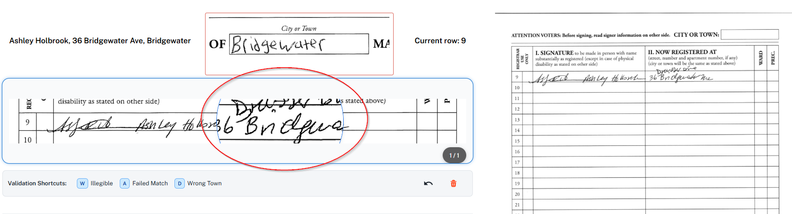
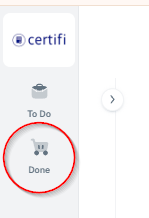
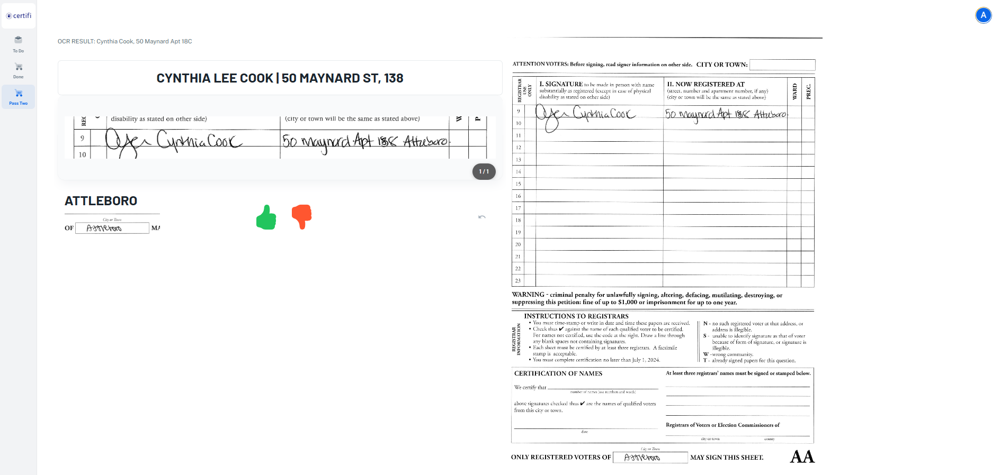
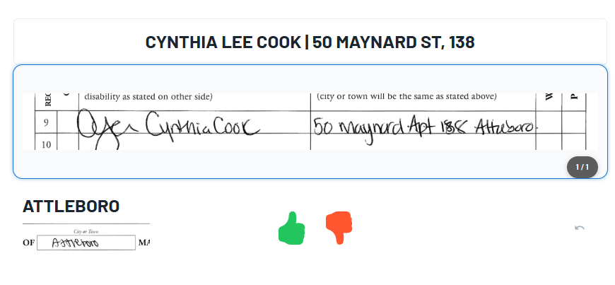
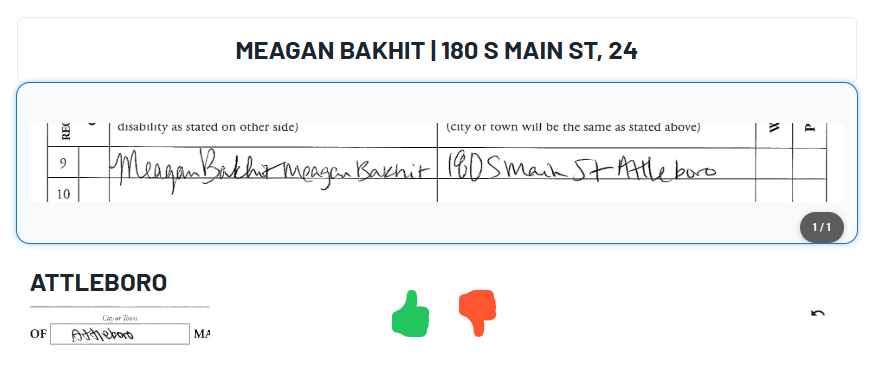
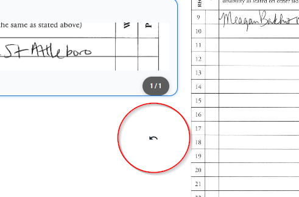
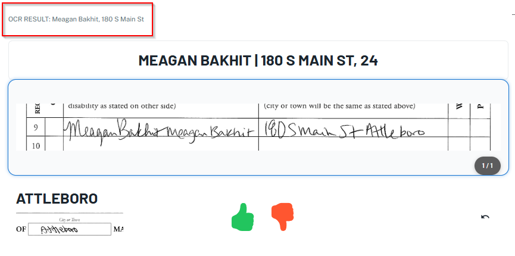
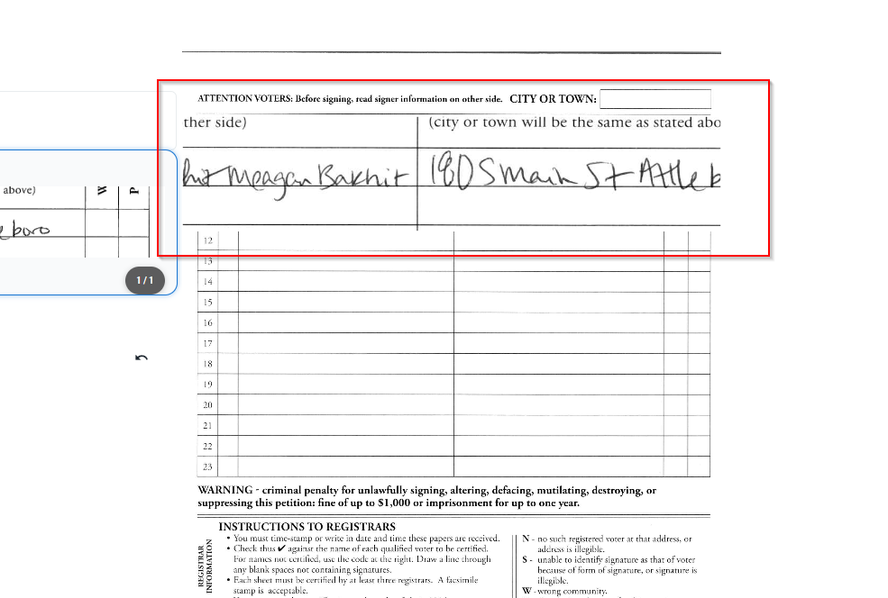
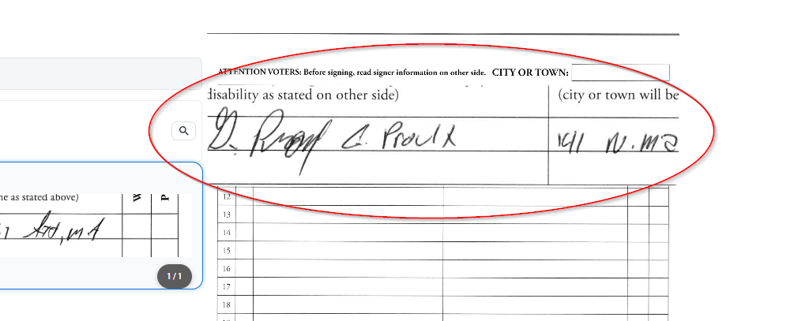

# Your Environment

Validating is a simple task with a lot of nuance. Let's go over all the nuance here with some examples.

When we refer to a "signature," we are referring to the entire row of one person's handwritten data, not just the actual signature.

There are three "passes" that signatures may need to go through:

## Search

The first pass is the one and only time a signature is validated. Only the signatures that weren't autovalidated are seen in the first pass. Compensation for this pass is $0.05 per signature.

<figure><figcaption></figcaption></figure>

Let's break down the parts of this panel from left to right:

On the left is the list of sheets you have been assigned to validate and a counter for the amount of signatures remaining. You don't need to click around here. To give you more room on the screen, you can collapse this screen with the small arrow button on the right.

<figure><figcaption></figcaption></figure>

In the middle is the section where your main focus will be.&#x20;

<figure><figcaption></figcaption></figure>

Above and to the left of the signature image is what the AI interpreted from reading the signature image.

In the center is the signature image itself that you'll be viewing, with a splice of the municipality name above it.

You will also see the Current Row field to the top right of the signature image, showing you which row the image is supposed to be showing, in the event that the image splicing mechanism is experiencing errors.

<figure><figcaption></figcaption></figure>

Below it is the search box, where the AI's attempt at reading the address is automatically searched.&#x20;

You'll then select the correct match, if any appear at all.

You will see this animation.

<figure><figcaption></figcaption></figure>

Sometimes the AI does not read the address correctly which causes no matches to appear. In this case, you will edit the entry to be a more accurate translation of the address and municipality, then press Enter to search.

If there are still no matches, you'll press the key that corresponds to the reason why you couldn't find a match.


After reading through all of this section, refer to the section [How do I search effectively?](https://powers-brogans-organization.gitbook.io/validator-documentation/how-do-i-search-effectively) and [Types of invalidity](types-of-invalidity.md) for more validation guidelines.


<figure><figcaption></figcaption></figure>

There are three classifications for marking a signature invalid, which you can utilize by clicking on the splice and then pressing the key that correlates to the classification you want to select.

In this example, the validator pressed the "a" key to mark the signature as a Failed Match.

<figure><figcaption></figcaption></figure>

If you make a mistake, you can use the undo button to go back to your previous signature. This function does not allow you to go back any further than your previous signature.

<figure><figcaption></figcaption></figure>

If you encounter any crossed out signatures, splicing issues, or signatures written across two rows, which is explained more in [How do I search effectively?](https://powers-brogans-organization.gitbook.io/validator-documentation/how-do-i-search-effectively), you can use the delete button to remove any extra rows.

<figure><figcaption></figcaption></figure>

You can utilize our live zoom feature to zoom into both the splice and full sheet by hovering over them.

<figure><figcaption></figcaption></figure>

You can view all of your completed sheets in your "Done" tab. This shows you all of the signatures you've validated and your ultimate decision, showing the most recently validated sheets at the top. You shouldn't need to use this feature much.

<figure><figcaption></figcaption></figure>

Lastly, on the right side of your screen is the full petition sheet which you'll only refer to when someone signs across multiple lines or, like mentioned above, the image splicing mechanism is experiencing errors and you need to refer to the full sheet to see the correct row.

<figure><figcaption></figcaption></figure>

## Match

In Basic, you will only see signatures that were initially marked as valid by the AI.

Your goal is to find as many false positives as possible and correctly mark them invalid. There is no search function, only visual comparison.

If you are unsure of a signature, always resort to marking it invalid. Press "v" to mark a signature valid, and press "x" to mark it invalid. The pay for this round is $0.02 per match that you affirm and $0.04 per match that you deny.

<figure><figcaption></figcaption></figure>

Start by clicking on the splice to select it.

<figure><figcaption></figcaption></figure>

Compare the images of the printed name, address, and town to their corresponding text. Then, press v to mark a signature valid and x to mark it invalid.

<figure><figcaption></figcaption></figure>

If you make a mistake, you can use the undo button to go back to the previous signature, but you cannot go back any further than the previous one.

<figure><figcaption></figcaption></figure>

You can utilize the AI results to help you navigate through splicing issues.

<figure><figcaption></figcaption></figure>

Don't forget about the live zoom feature that works for both the splice and the full sheet.

<figure><figcaption></figcaption></figure>

## Splicing

In Expert, you will only see signatures that the Basic validator marked invalid.

Your goal is to find as many valid signatures as possible and correctly mark them valid, all the while ensuring you don't generate a false positive. You have a search function, and you must perform multiple searches before confirming that a signature is actually invalid.

The pay for this round is $0.04 per invalid signature and $0.07 per valid signature.

<figure><figcaption></figcaption></figure>

Start by clicking on the splice to select it.

<figure><figcaption></figcaption></figure>

Examine the reason for invalidity before searching. Search multiple times before confirming that a signature is actually invalid, and refer to the section [How do I search effectively?](https://powers-brogans-organization.gitbook.io/validator-documentation/how-do-i-search-effectively). Skilled searching is the core component of Expert.

<figure><figcaption></figcaption></figure>

Use the following hotkeys to mark the reason for invalidity for the signatures you have confirmed to be actually invalid:  &#x20;

* W - Illegible  &#x20;
* A - Failed Match  &#x20;
* D - Wrong Town

<figure><figcaption></figcaption></figure>

If you make a mistake, you can use the undo button to go back to the previous signature, but you cannot go back any further than the previous signature.

<figure><figcaption></figcaption></figure>

You can utilize the AI results to help you navigate through splicing issues.

<figure><figcaption></figcaption></figure>

You can delete any extra splices with the delete function. If you're unsure of how to respond to splicing issues, refer to your supervisor, as you are the final decision maker for splicing.

<figure><figcaption></figcaption></figure>

Don't forget about the live zoom feature that works for both the splice and the full sheet.

<figure><figcaption></figcaption></figure>
